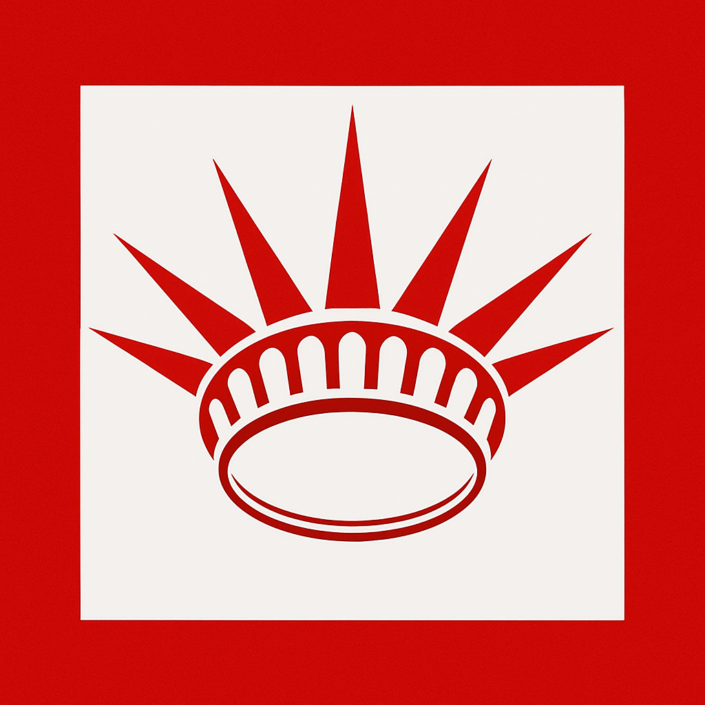
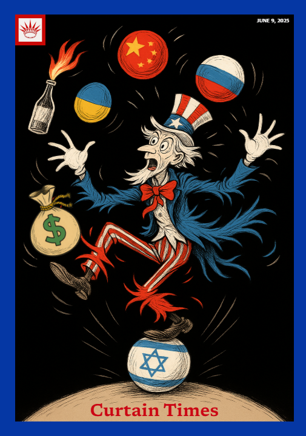

<!DOCTYPE html>
<html lang="en">
<head>
  <meta charset="UTF-8">
  <meta name="viewport" content="width=device-width, initial-scale=1.0">
  <title>Curtain Times Magazine</title>
  <link rel="preconnect" href="https://fonts.googleapis.com">
  <link rel="preconnect" href="https://fonts.gstatic.com" crossorigin>
  <link href="https://fonts.googleapis.com/css2?family=Newsreader:opsz,wght@6..72,400;6..72,700&display=swap" rel="stylesheet">
  
</head>
<body>
  

    
The Curtain Times

  

  

    
  

  <header>
    <nav>
      <a href="#">Issue</a>
      <a href="#">Archive</a>
      <a href="#">Reports</a>
      <a href="#">About</a>
    </nav>
  </header>

  

  <h2 class="issue-title">Issue 1 – June 9, 2025</h2>
</body>
</html>
